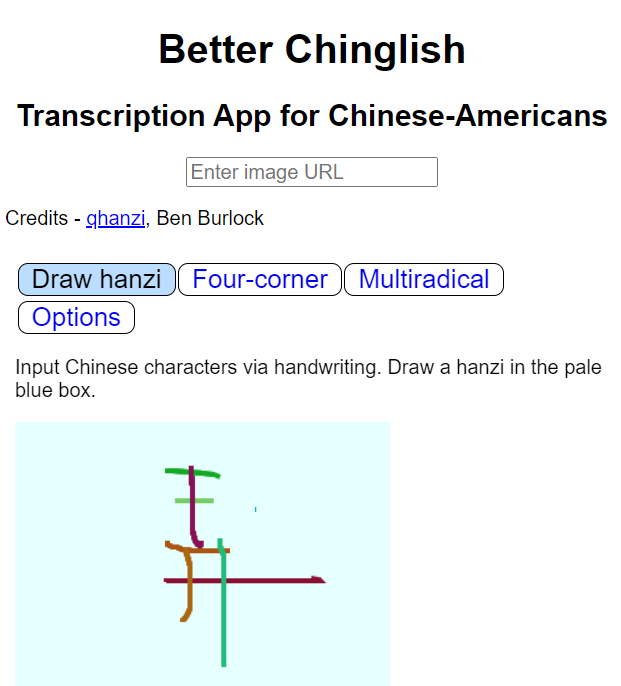
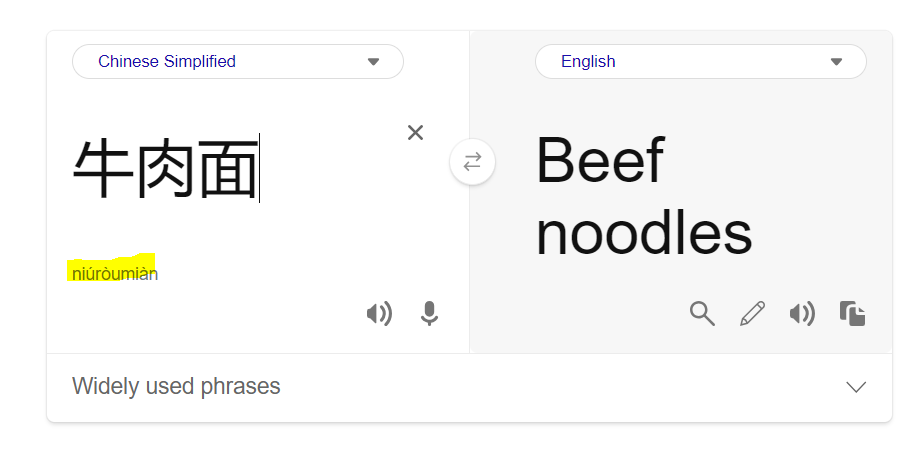
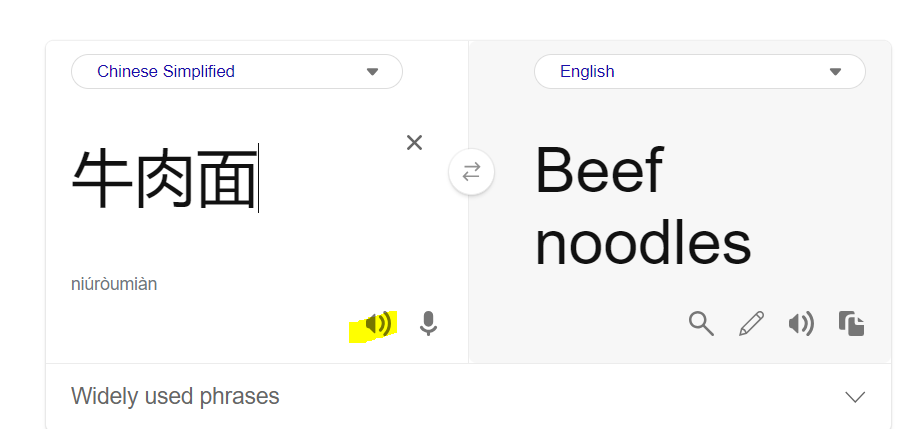

# Better Chinglish

Transcription App for Chinese-Americans

## Site URL (Try it Yourself!)

- **https://solderq35.github.io/better-chinglish**

## Video Demo

- https://youtu.be/-vmA7UhrdP0?t=46s
  - I skipped to 0:46 timestamp above as I assume most people know how to upload images to services like [ImgBB](https://imgbb.com/) or [Imgur](https://imgur.com/), but if not, be sure to watch the first 46 seconds of demo

## Usage Instructions / Screenshots

- (Optional, only if it's too awkward to hold the menu etc)
  - Upload images to services like [ImgBB](https://imgbb.com/) or [Imgur](https://imgur.com/)
  - Copy image URL and put it in the "Enter Image URL" link
- Look at Chinese characters and carefully write it in the handwriting input [qhanzi](https://www.qhanzi.com/) section
  - Shoutouts to Ben Burlock for great work on [qhanzi](https://www.qhanzi.com/)
  - You can stop in the middle of writing a Chinese character and come back, unlike with native iPhone Chinese handwriting input.
    
- When you are all done writing the Chinese characters by hand, copy and paste the Chinese characters into the [Bing Translate](https://www.bing.com/translator?to=en&setlang=si) section
  - You will be able to see the [Pinyin](https://yoyochinese.com/chinese-learning-tools/Mandarin-Chinese-pronunciation-lesson/pinyin-chart-table) pronunciation and meaning
    
  - If you still can't pronounce it, you can click the little speaker icon in the Bing Translate window to hear how it's pronounced
    

## Purpose

I have plans to expand this app's capabilities, but for now:

- The local Chinese restaurants in Irvine, CA (I am here on an internship) often feature staff / waiters who do not speak English
  - Which is fine for me, since I am fluent from learning to speak (Mandarin) Chinese from my parents
  - However, I do have to order in Chinese, and I often cannot read the menu very well (having a much shakier Chinese literacy)
    - Thus, I need a way to accurately decipher Chinese characters on the menu if I don't already recognize them
- There is native support for Chinese handwriting input on iPhone, but it's not very good / clearly targeted at fluent Chinese readers / writers
  - The moment you switch browser or app tabs on iPhone, the handwriting input _resets_, which is an issue for someone like me who forgot the stroke order of a character on the restaurant menu midway through it
- Thus I am using Iframes with [qhanzi](https://www.qhanzi.com/), a website that has way better handwriting input and does not reset your input the moment you leave the page
- Currently I have to open qhanzi, Google or Bing Translate, and maybe also a photo on my phone (since it's awkward to stand around holding the menu) to order
- I need the Google or Bing Translate to:
  - Get the [Pinyin](https://yoyochinese.com/chinese-learning-tools/Mandarin-Chinese-pronunciation-lesson/pinyin-chart-table) transcription of the characters (the most important part, _how to actually pronounce the characters so I can make my restaurant food order in Chinese_)
  - Get the meaning of the characters (important in case there is some term I don't recognize, which does happen on occasion)
  - PS I am using Bing Translator in my version cause Google Translator blocks Iframes for security reasons or something

## The Idea

- I use Iframes to combine what were otherwise 3 separate services (image embed, handwriting input, translator) into one app so I don't have to tab in and out on my phone constantly, greatly improving my workflow
- Had to modify Iframes to allow for sharing clipboard between Iframes

## Site Setup

It probably doesn't matter, but just in case, I am on node version `16.20.0` (run `node -v` in terminal to check). You can change node versions easily with [nvm for Unix](https://github.com/nvm-sh/nvm) or [nvm for Windows](https://github.com/coreybutler/nvm-windows)

`npm install`

- Installs dependencies

`npm start`

- Runs the app in the development mode, launches at [http://localhost:3000](http://localhost:3000)

`npm run prettier`

- Formats code

## Githug Pages Deployment Tips

- Workflow Permissions - https://github.com/orgs/community/discussions/26694#discussioncomment-5551445
  - Turn on "Read and Write Permissions" for "Workflow Permissions"
- Note the [homepage](https://github.com/solderq35/better-chinglish/blob/main/package.json#L7) variable in `package.json` to ensure the deployed site pulls the static files from right directory

## Sources / Credits

- [qhanzi Handwriting Input](https://www.qhanzi.com/) - Credits to Ben Bullock
- [Bing Translator](https://www.bing.com/translator?to=en&setlang=si) - Thanks for not blocking Iframes unlike Google Translate
- [This Sandbox](https://codesandbox.io/s/9gggb?file=/src/index.js) from Ramesh Patel I used as a basic template for getting started on the Iframe stuff
